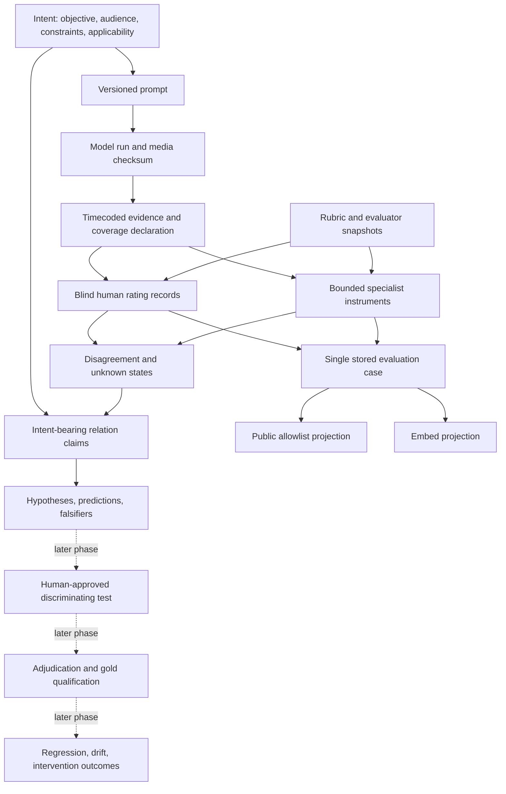

# Backend architecture at the Phase 4 checkpoint

The durable unit is a versioned evaluation under an explicit intention. Models are replaceable instruments. The four future surfaces—lab, Think With Me, case study and repository—share this backend and its evidence.

## Package boundaries

`domain` owns immutable Pydantic values, not provider calls or UI behavior. `rubrics` owns a named provisional rubric, while `scoring` applies it to declared applicable criteria without averaging. `agreement` measures agreement on same-rubric same-round ordinal judgments; it cannot confer truth. `persistence` validates links and stores typed snapshots plus normalized reference/submission indexes. `providers` defines replaceable capabilities; the only implementation is a rule-based simulator. `swarm` bounds that trusted simulator and exposes failure states. `presentation` exports allowlisted data. `api` is deliberately only a stub.

Dependencies point inward to domain types. Tests can replace an instrument without replacing the ontology, scoring or persistence. SQLite is the tested database. SQLAlchemy provides a clean portability boundary; PostgreSQL has not been tested and needs a driver, migration tooling, append-only privilege policy, transaction isolation and locking validation. We do not call schema portability a verified migration.

## Version and storage contract

Artifact identity is `(kind, id, revision)`. A canonical SHA-256 covers the full typed snapshot. Revisions append without gaps and references pin exact revisions. A conflicting write fails. Repeating an identical write returns its existing digest. Human and pairwise ratings are single immutable observations; later corrections require adjudication rather than silently adding another vote. Rater revisions preserve stable identity for assignment and duplicate prevention.

Every referenced artifact must exist. SQLite foreign keys additionally enforce relational integrity. The `artifacts` table stores validated typed JSON snapshots; the separate reference and submission tables enforce relationships and unique observation units. This avoids changing historic records when schemas or evaluators evolve. These are not arbitrary untyped JSON domain objects, although analytical column indexes and migration tooling will be needed as scale grows.

SQLite append-only triggers reject update/delete on core records, references and unique submissions. Hash checks detect accidental alteration on load. A local database owner can bypass both; this is not authenticated, tamper-proof provenance. Commit-time round admission uses a serialized SQLite writer transaction so closure cannot interleave with rating insertion. Concurrent live hosting remains outside the demonstrated deployment scope.

## Decision and authority boundaries

Unknown, failed and pass are distinct. Pass is a provisional rubric result, never a shipping authorization. Declared intent determines applicability; an agent proposal cannot grant itself passing authority. Approval names are trusted fixture assertions until identity/authentication is implemented. A typed edge explains why a relationship matters and who asserted it; it does not establish that a causal mechanism is true.

The provider receives no other agent results or human scores. All specialist outputs in this demo come from a single authored fixture family and are therefore not independent witnesses. No debate loop or majority approval exists. The approval harness verifies executable software contracts and replay, then explicitly leaves empirical validation and deployment unapproved.

## Evidence levels

1. Source-supported design: literature and standards pages inspected.
2. Tested software behavior: fixtures, negative controls, independent review and replay.
3. Pending observation: actual media decoding and qualified instrument behavior.
4. Pending scientific validation: independent humans, holdouts, measured usefulness and errors.
5. Pending operations: authenticated APIs, live budgets, deployment and monitoring.

Results at one level must not be reported as evidence for another.
